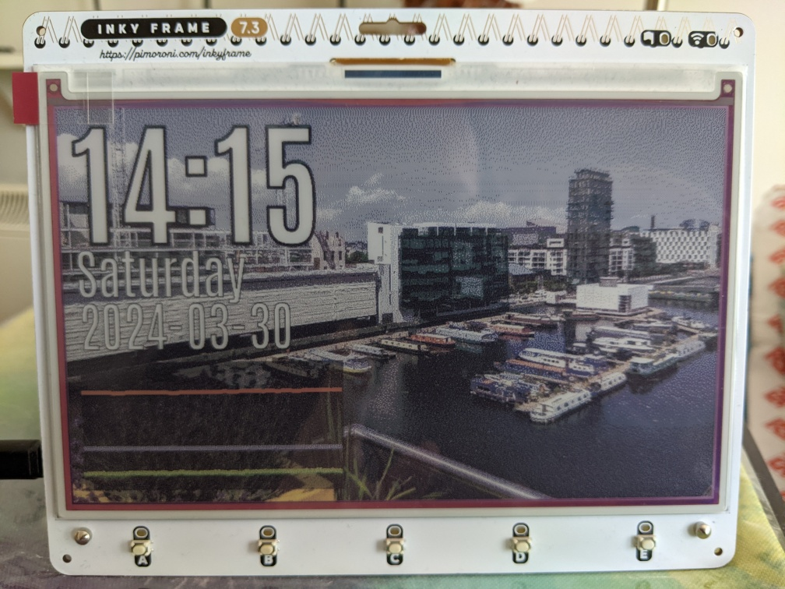

# LionsPhil's Inky Frame stuff

Scripts for Pimoroni's [Inky Frame](https://shop.pimoroni.com/products/inky-frame-7-3).

## New launcher

`main.py` is cleaned-up and rewritten much like I did for Tufty, with the same `boot.txt` direct-boot support.
Memory is less of a critical issue here (at least on the 7.3" with its nice external framebuffer RAM), but instead the stock launcher does a *lot* of setup and runs a whole update/draw loop for the preloaded examples.
Direct-boot is now configured per-entry and bypasses all that for examples that want to run "raw".

PaperThin replaces "Daily Activity" in the menu, since it can only offer five options.
That would be `{"script": "daily_activity", "name": "Daily Activity", "direct": False},` if you want to restore it.

## PaperThin

PaperThin is a thin-client setup for Inky Frame, allowing you to eschew on-board storage for pushing it off to a server.



### Server

`paperthin-server` is a simple Flask server that serves random images encoded nicely for the frame, selected from a category per-button.
Put *appropriately-sized* images in `responses/a`, `b`, etc.
You run this on a Linux server of your choice; e.g. a normal Raspberry Pi or Zero.

If you add an `overlay.py` that implements a function `overlay(image: Image.Image, request: flask.Request) -> Image.Image:`, you can draw over the image before it is returned.
`overlay-example.py` is an example implementation of this that draws a clock and some graphs from [prometheus-enviro-sensors](https://github.com/LionsPhil/prometheus-enviro-sensors) data.

You can also implement a `button_override(index: int, request: flask.Request) -> flask.Response|None:` function to completely override the behaviour of some buttons.
The index will be 0 to 4 for buttons A to E; return `None` to use the default behaviour of picking a random image from that folder.
Again, see `overlay-example.py` for an example, this time pulling images from the Internet involving a lot of scraping and image reprocessing the Inky itself can't really handle.
(If you want to also apply the image overlay, you will have to add a call to it before forming the response.)

The server can of course be whatever you want (that is somewhat the point), but you may still find the other libraries useful.
`paperutils.py` is a library for dithering server-side and building PaperThin-specific responses, and can use `picorle.py` to encode in the PRI2 image format that the client knows how to stream directly to the display.

#### Deployment

I recommend using `gunicorn` (packaged for Debian), partially because Flask will complain about using its development server, and partially because PIL or Wand seem to leak memory and being able to restart workers every few requests is a lame but effective mitigation:

```sh
gunicorn --bind=${YOUR_IP:?}:5000 --timeout 120 --max-requests 10 \
  --chdir=${SERVER_PATH:?} --access-logfile - 'app:app'
```

You can omit `--chdir` if you run it from the `paperthin-server` directory.
You can add `--reload` to have the server restart on source changes, for development.

### Client

`paperthin-client/paperthin.py` is the thin client side that runs as a normal micropython app on the Inky.
It uses the same `secrets.py` setup as the stock examples, and a `paperthin_config.py` full of other constants, such as the URL of the server to talk to.
Copy `paperthin_config_example.py` as a starting point; you almost certainly want to change `_BASE_URL`, and possibly `_WIFI_COUNTRY`.

PaperThin requests:

- A base URL with a subpath for startup and each front button.
  These are configurable, but normally `/hello` and `/a`, `/b`, `/c`, `/d`, `/e`.
  - `/heartbeat` is fetched *and completely ignored* on USB power to try to keep the wireless alive.
- `GET` for anything it does from power-on, refreshes (see below), or timers.
- `POST` for explicit user button presses.
  (So you can follow normal web practice and make POSTs actually do something.)
- Query parameters (`?foo=bar+baz&quux=garply`...) for:
  - The display size, `w` and `h`.
  - The hostname, `hostname`, set in the script (and attempted to set on the network).
  - The battery voltage, `v`, if not on USB power.
  - `error`, for some very narrow cases.

Responses PaperThin understands:

- `text/plain` responses will be displayed as monospace black-on-white text.
- `image/jpeg` and `image/png` responses will be displayed fullscreen.
  - If the custom `X-Dither` header is set in the response, they will be dithered.
    - PNGDEC seems to always dither. It may be PicoGraphics doing it, I'm not sure.
  - These buffer into RAM. Try not to send full 32-bit color PNGs.
    - If they are over 32K (the `_TEMPFILE_THRESHOLD` constant), they will try to buffer to flash, but that is also quite limited. Buffering to an SD card is not currently implemented.
- `image/x.pico-rle`, an update of a lossless streamable image format I made for Tufty, will also display fullscreen.
  - This is a streaming format that goes straight from the network to the display, so doesn't have memory limitations.
  - Since it writes through PicoGraphics, it is always subject to that dithering, and is unfortunately slower.
- Empty responses *of any type* will leave the screen as-is.
- A `Refresh` header with normal `time; url` syntax, where after `time` seconds it will fetch `url`.
  - The time will be rounded up to at least one minute.
    This is the least it can sleep on battery, and with ~40s to refresh the delay, much less than this would rapidly make the screen just constantly be a blinking, repainting mess rather than showing something useful.
  - The time is counter from *after* the repaint is finished, so `60` would actually fetch more like every 100 seconds.
  - The fetch will get the same query parameters as usual.
    Note the URL-building is dumb as bricks and will not behave right if `url` already has query parameters.
- In theory, it will try to do HTTPS.
- In theory, it *might* work with IPv6. That's up to the micropython libs.

Things PaperThin does not understand:

- JPEGs or PNGs that are the wrong size or encoding (for example, progressive JPEGs).
  Preprocess them server-side!
- HTML, at all, of any kind! Pre-render documents into images. Forget JavaScript.
- Fragment identifiers (`#foo`) in URLs; it'll blindly send these to the server.
- Cookies. Try using the `hostname` as a key for anything stateful.
- HTTP/2, SPDY or other such shenanigans. It talks HTTP/1.0 and tolerates 1.1.
- Sloppy servers that don't set `Content-Type` and `Content-Length` correctly.
  Both of these are hard *required* to interpret the response.
- Any status code which is not in category 2XX (success). That includes redirects!
- Any kind of transfer or content encoding except `identity`.
  No `chunked`, no `gzip`, none of that.
- Anything that is not UTF-8.
- Any other MIME type.

💡 On battery, there's a delay between the buttons causing the pico to wake up, and starting MicroPython and being able to read them.
If you're pressing the A-to-E buttons to change screen on battery, hold them a moment until the matching LED lights to confirm the press has been read.
Otherwise, PaperThin won't know what happened, and will just follow the last refresh or default `/hello` handler.

Three AA batteries power the display for about 1,200 updates; that's fetching and decoding a PRI image from the network each time, and doing the double-refresh screen painting.
Exact life will vary by lots of things; the "danger zone" where it seems to start to brownout and get stuck updating is below 3.1 volts.

## Development

### Flask

⚠️ Remove the `FLASK_DEBUG=1` on untrusted networks; it deliberately allows remote arbitrary code execution.

Use `FLASK_DEBUG=1 flask run --host=0.0.0.0` to make the server listen to traffic from the whole network (like the Frame), not just localhost.

### WSL

⚠️ Disabling the firewall assumes you're on a private, trusted LAN, like at home.
That's **not safe** if you don't trust every computer on your network.

If you're running the server half on Windows under WSL2, there's [some nonsense](https://learn.microsoft.com/en-us/windows/wsl/networking#accessing-a-wsl-2-distribution-from-your-local-area-network-lan) with VM NAT you have to work around (and there is no simple port-forwarding interface as with VirtualBox).
The short of it is:

- Run `ip addr show dev eth0` in the guest to get your virtual IP address.
- Run `netsh interface portproxy add v4tov4 listenport=5000 listenaddress=0.0.0.0 connectport=5000 connectaddress=`_(that address)_ in an administrator PowerShell to set up port forwarding.
- Turn off Windows Firewall, or configure it to allow port 5000.
  - Network icon > Properties > Configure firewall and security settings > Private network (active) > Microsoft Defender Firewall > Off
  - You can probably instead hit "Advanced settings" at the last step, incoming rules, and create one that isn't application-bound instead.

  Afterwards, turn the firewall back on (Windows won't let you forget) and delete the forward: `netsh interface portproxy delete v4tov4 listenport=5000 listenaddress=0.0.0.0`

  The VM IP will change, requring you to change the forward, every time WSL restarts it.

Alternatively, if you [understand the tradeoffs](https://learn.microsoft.com/en-us/windows/wsl/compare-versions), [you can convert from WSL2 to WSL1](https://learn.microsoft.com/en-us/windows/wsl/install#upgrade-version-from-wsl-1-to-wsl-2).
The WSL Linux VM will just get the same network interface as your Windows host.
